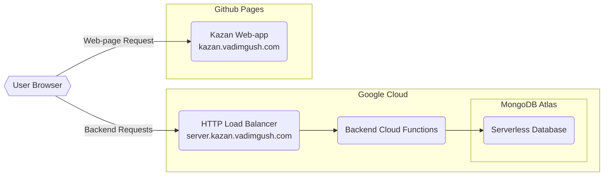

# Server

This directory contains source code for the server-side of Kazan app. It's Node.js app that uses Express framework (though wrapped as a Google Cloud Function).

## Infrastructure

This is a flowchart that somewhat describes the general idea of Kazan infrastructure:

