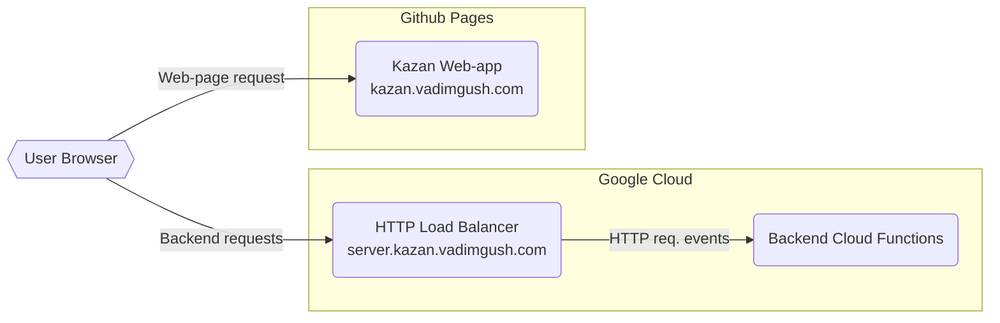

# Infrastructure

This is a flowchart that somewhat describes the general idea of Kazan infrastructure:

```mermaid
flowchart LR
  kazan-lb(HTTP Load Balancer\nserver.kazan.vadimgush.com)
  kazan-function(Backend Cloud Functions)
  kazan-client(Kazan Web-app\nkazan.vadimgush.com)
  browser{{User Browser}}
  
  browser -->|Web-page request| kazan-client
  browser -->|Backend requests| kazan-lb
  
  subgraph Google Cloud
  direction LR
  kazan-lb -->|HTTP req. events| kazan-function
  end
  
  subgraph Github Pages
  kazan-client
  end
```
